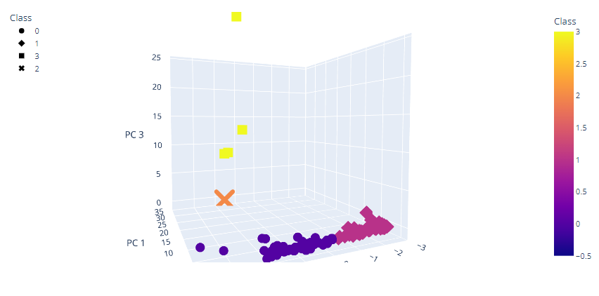

# Challenge_18

## Background

Accountability Accounting, a prominent investment bank, is interested in offering a new cryptocurrency investment portfolio for its customers, nevertheless, the company needs to create a classification system for this new investment.  

## Objective
Create a report that includes the cryptocurrencies currently traded in the market and provide groups for them to create a classification system for this new investment.

## Performed Analysis

### 1) Data Processing

Not useful data was removed (no traded, null values, etc). 

### 2) Principal Components Analysis

We performed a PCA analysis to reduce the basis to 3 dimensions with PCA algorithm. 

### 3) Elbow Curve

We created and Elbow curve to determine that optimal number of clusters is 4. 

### 4) Clustering

We used K Means algorithm to create 4 clusters to split the 532 cryptocurrencies.

#### Table 1 - Tradable Crypto Currencies

### 5) Visualizations

We created a couple of visualizations of the final cluster to ease comprehension: 

#### Graph 1 - Clusters 3D Scatter Plot

#### Graph 2 - 2D Mined vs Supply Graph

